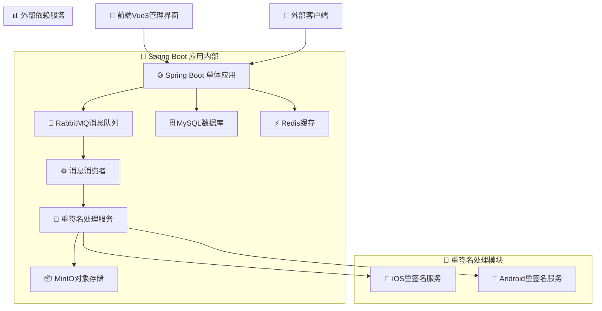
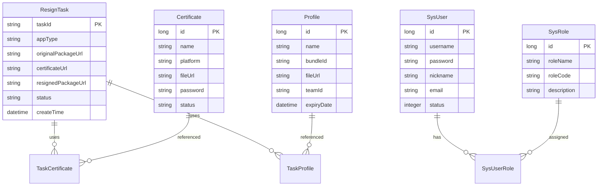
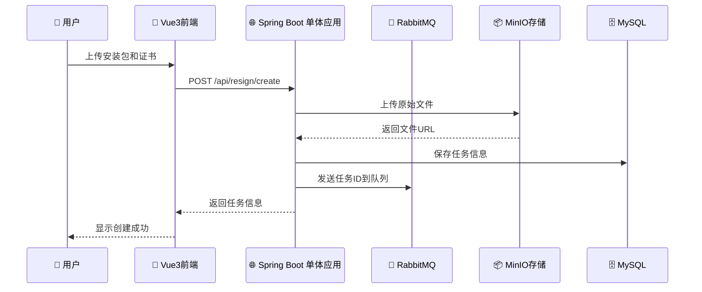
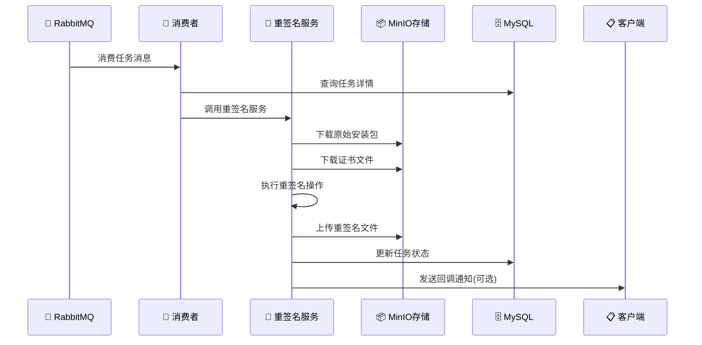
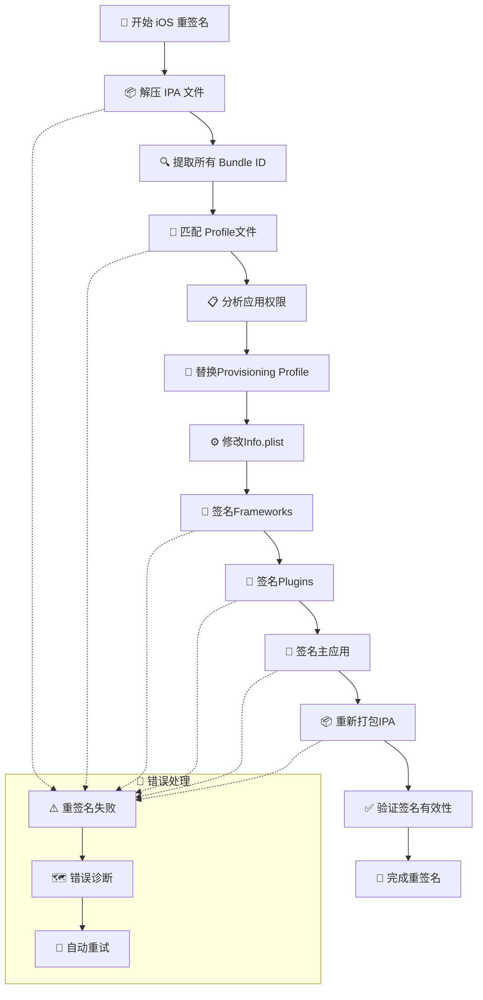

# 📱 Resign-System 移动端安装包重签名服务

[](https://spring.io/projects/spring-boot)
[](https://vuejs.org/)
[](https://openjdk.java.net/)
[](LICENSE)

## 🎯 项目概述

**Resign-System** 是一个企业级的移动端安装包重签名服务，专门用于解决iOS、Android、鸿蒙系统应用在不同环境下的重签名需求。该项目采用前后端分离的单体架构，通过异步处理模式确保高性能和高可用性。

### 🌟 核心价值
- **多平台支持** - 统一支持iOS、Android、鸿蒙三大移动平台
- **企业级架构** - 基于Spring Boot 3.x + Vue 3.x的现代化技术栈
- **高性能处理** - 异步消息队列架构，支持高并发任务处理
- **智能签名** - 自动分析应用结构，智能匹配证书和Profile文件
- **运维友好** - 完善的监控、日志和管理界面

### 🎯 解决的核心问题
- 移动应用安装包在不同环境下的快速重签名需求
- 支持多平台的统一重签名服务
- 证书和Profile文件的集中管理
- 任务状态跟踪和失败重试机制
- 企业级应用分发和管理场景

## 🚀 最新更新 - 项目架构重构 (v2.1)

### 🏗️ 架构简化
- **去除策略模式**：简化代码结构，提高可维护性
- **平台服务独立**：iOS、Android、鸿蒙各自独立的服务类
- **直接依赖注入**：不再使用工厂模式，直接注入平台服务
- **代码量减少**：删除抽象接口和工厂类，降低复杂度

### ✨ iOS签名系统特性
- **智能Profile匹配**：自动匹配主应用和插件的Profile文件
- **权限分析**：自动提取和分析应用权限信息  
- **复杂签名支持**：正确处理Frameworks、Plugins、Main App的签名顺序
- **通配符Profile**：支持通配符Profile文件匹配多个Bundle ID
- **签名验证**：自动验证签名有效性

### 🔧 技术改进
- **多Profile支持**：一个任务可以上传多个Profile文件
- **Bundle ID智能提取**：自动从IPA中提取所有Bundle ID
- **错误处理增强**：详细的错误诊断和重试机制
- **性能优化**：异步处理和资源管理优化

### 📋 使用示例

#### iOS签名
```bash
curl -X POST "http://localhost:8080/api/resign/create" \
  -F "appType=IOS" \
  -F "originalPackageFile=@/path/to/app.ipa" \
  -F "certificateFile=@/path/to/cert.p12" \
  -F "certificatePassword=your_password" \
  -F "profileFiles=@/path/to/main_app.mobileprovision" \
  -F "profileFiles=@/path/to/plugin1.mobileprovision" \
  -F "bundleIds=com.example.mainapp" \
  -F "bundleIds=com.example.mainapp.plugin1"
```

#### Android签名
```bash
curl -X POST "http://localhost:8080/api/resign/create" \
  -F "appType=ANDROID" \
  -F "originalPackageFile=@/path/to/app.apk" \
  -F "certificateFile=@/path/to/keystore.jks" \
  -F "certificatePassword=your_password"
```


## 🛠️ 技术栈详解

### 后端技术栈
| 技术 | 版本 | 作用 |
|------|------|------|
| **Spring Boot** | 3.1.10 | 现代化Java企业级框架 |
| **MySQL** | 8.0.33 | 关系型数据库，存储任务状态和系统配置 |
| **MyBatis-Plus** | 3.5.5 | 增强版ORM框架，简化数据库操作 |
| **RabbitMQ** | 3.8+ | 消息队列，实现异步任务处理 |
| **MinIO** | 8.5.6 | 对象存储，存储安装包和签名文件 |
| **Redis** | 6.0+ | 缓存和会话管理 |
| **Hutool** | 5.8.23 | Java工具库 |
| **JDK** | 17 | Java运行环境 |

### 前端技术栈
| 技术 | 版本 | 作用 |
|------|------|------|
| **Vue.js** | 3.x | 渐进式JavaScript框架 |
| **Vite** | 4.4.9 | 现代化前端构建工具 |
| **Pinia** | 2.1.6 | Vue3状态管理库 |
| **Element Plus** | 2.3.12 | Vue3 UI组件库 |
| **Axios** | 1.5.0 | HTTP客户端 |
| **ECharts** | 5.4.3 | 数据可视化 |

## ✨ 核心功能模块

### 📋 任务管理模块
- **任务创建** - 支持多种文件上传方式和批量操作
- **状态监控** - 实时查看任务处理状态和进度
- **智能重试** - 失败任务自动/手动重试机制
- **批量操作** - 支持批量删除和管理操作
- **包解析** - 自动解析应用包信息和Bundle ID

### 🔐 证书管理模块
- **多平台证书** - 支持iOS (.p12) 和Android (.jks) 证书
- **证书验证** - 自动验证证书有效性和到期时间
- **Profile管理** - iOS Provisioning Profile文件管理
- **智能匹配** - 自动匹配应用Bundle ID和Profile文件

### 👥 用户权限模块
- **用户管理** - 完整的用户CRUD操作
- **角色权限** - 基于角色的权限控制系统
- **认证授权** - JWT Token认证机制
- **操作审计** - 完整的操作日志记录

### 📁 文件服务模块
- **对象存储** - 集成MinIO高可用对象存储
- **多种访问模式** - 支持直接访问、代理访问、预签名URL
- **文件管理** - 统一的文件上传、下载、删除接口
- **安全控制** - 文件访问权限和安全策略

### 🔄 异步处理特性
- **消息队列** - RabbitMQ实现任务异步处理
- **高并发** - 支持多消费者并行处理
- **失败重试** - 死信队列和重试策略
- **回调通知** - 任务完成后主动通知

## 🏗️ 系统架构

### 整体架构图


### 架构特色
#### 🚀 异步处理架构
- **消息驱动** - 使用RabbitMQ实现任务解耦
- **可扩展性** - 支持水平扩展消费者节点
- **容错机制** - 死信队列处理失败任务

#### 🎨 单体应用设计
- **模块化** - 按业务功能划分服务模块
- **松耦合** - 各模块间通过接口进行交互
- **统一部署** - 单一JAR包部署，简化运维

#### 🔄 前后端分离
- **API优先** - RESTful API设计
- **响应式** - Vue3组合式API
- **组件化** - 可复用UI组件

## 📚 项目结构分析

### 🏢 后端模块结构
```
src/main/java/com/example/resign/
├── audit/           # 📋 审计日志模块 - 操作记录和审计跟踪
├── business/        # 📊 业务日志处理 - 业务操作日志
├── config/          # ⚙️ 系统配置类 - 数据库、缓存、消息队列配置
├── controller/      # 🌐 REST API控制器 - 对外提供RESTful接口
├── entity/          # 📛 数据库实体类 - JPA实体映射
├── enums/           # 🔢 枚举定义 - 任务状态、应用类型等
├── exception/       # ⚠️ 异常处理 - 全局异常拦截和处理
├── mapper/          # 🗄️ MyBatis映射器 - 数据访问层
├── model/           # 📦 数据传输对象
│   ├── dto/         #   → 数据传输对象 (API请求/响应)
│   ├── vo/          #   → 视图对象 (前端展示)
│   └── common/      #   → 公共数据模型
├── mq/              # 📨 消息队列处理 - RabbitMQ消费者
├── service/         # 🔧 业务服务层 - 核心业务逻辑
│   ├── impl/        #   → 服务实现类
│   ├── IosResignService.java      # iOS重签名服务
│   ├── AndroidResignService.java  # Android重签名服务
│   └── ResignTaskService.java     # 任务管理服务
├── util/            # 🛠️ 工具类 - 签名工具、文件处理等
└── ResignApplication.java   # 🚀 应用启动类
```

### 🎨 前端模块结构
```
resign-admin-vue3/src/
├── api/             # 🌐 API接口封装 - 与后端接口交互
│   ├── task.js      #   → 任务管理相关接口
│   └── user.js      #   → 用户管理相关接口
├── router/          # 🗺️ 路由配置 - Vue Router配置
├── store/           # 💾 Pinia状态管理 - 全局状态
│   ├── auth.js      #   → 认证状态管理
│   ├── task.js      #   → 任务状态管理
│   └── user.js      #   → 用户状态管理
├── utils/           # 🛠️ 工具函数 - 通用工具和助手函数
└── views/           # 📋 页面组件
    ├── task/        #   → 任务管理页面 (创建、列表、详情)
    ├── certificate/ #   → 证书管理页面
    ├── user/        #   → 用户管理页面
    ├── system/      #   → 系统配置页面
    └── dashboard/   #   → 仪表盘页面
```

### 📊 数据模型设计

#### 核心实体关系


### ⚙️ 配置说明

#### 数据库初始化
```sql
-- 创建数据库
CREATE DATABASE resign_db CHARACTER SET utf8mb4 COLLATE utf8mb4_unicode_ci;

-- 导入初始化脚本
mysql -u root -p resign_db < src/main/resources/db/schema.sql
mysql -u root -p resign_db < src/main/resources/db/data.sql
```

#### 修改配置文件
编辑 `src/main/resources/application.yml`：

```yaml
# 数据库配置
spring:
  datasource:
    url: jdbc:mysql://localhost:3306/resign_db
    username: root
    password: your_password

# MinIO配置
minio:
  endpoint: http://localhost:9000
  accessKey: minioadmin
  secretKey: minioadmin
  bucketName: resign-apps

# 重签名工具路径配置
resign:
  tools:
    ios:
      sign-tool: /usr/bin/codesign
    android:
      sign-tool: /usr/local/bin/apksigner
```

### 💻 编译运行

#### 后端服务
```bash
# 编译项目
mvn clean package -DskipTests

# 运行服务
java -jar target/resign-system-0.0.1-SNAPSHOT.jar

# 或者使用Maven直接运行
mvn spring-boot:run
```

#### 前端项目
```bash
# 进入前端目录
cd resign-admin-vue3

# 安装依赖
npm install

# 启动开发服务器
npm run dev

# 构建生产版本
npm run build
```

### 🔍 验证安装

#### 检查后端服务
```bash
# 检查健康状态
curl http://localhost:8080/actuator/health

# 检查API接口
curl http://localhost:8080/api/resign/tasks/stats
```

#### 检查前端服务
- 访问: http://localhost:5173
- 默认管理员账号: admin / admin123

#### 检查基础服务
- **MySQL**: 端口 3306
- **Redis**: 端口 6379  
- **RabbitMQ 管理界面**: http://localhost:15672 (guest/guest)
- **MinIO 管理界面**: http://localhost:9001 (minioadmin/minioadmin)

## 🔄 核心业务流程

### 📋 任务创建流程


### ⚙️ 重签名处理流程


### 🔍 iOS重签名特殊流程


### 创建重签名任务

```
POST /api/resign/tasks
```

请求参数：

```json
{
  "appType": "IOS",
  "originalPackageUrl": "https://example.com/app.ipa",
  "certificateUrl": "https://example.com/certificate.p12",
  "certificatePassword": "password",
  "callbackUrl": "https://example.com/callback"
}
```

响应结果：

```json
{
  "code": 200,
  "message": "操作成功",
  "data": {
    "taskId": "550e8400-e29b-41d4-a716-446655440000",
    "appType": "IOS",
    "originalPackageUrl": "https://example.com/app.ipa",
    "status": "PENDING",
    "createTime": "2023-12-01T12:00:00"
  }
}
```

### 查询任务状态

```
GET /api/resign/tasks/{taskId}
```

响应结果：

```json
{
  "code": 200,
  "message": "操作成功",
  "data": {
    "taskId": "550e8400-e29b-41d4-a716-446655440000",
    "appType": "IOS",
    "originalPackageUrl": "https://example.com/app.ipa",
    "resignedPackageUrl": "https://minio.example.com/resign-apps/resigned/550e8400-e29b-41d4-a716-446655440000.ipa",
    "status": "SUCCESS",
    "createTime": "2023-12-01T12:00:00",
    "updateTime": "2023-12-01T12:05:00"
  }
}
```

### 重试失败任务

```
POST /api/resign/tasks/{taskId}/retry
```

响应结果：

```json
{
  "code": 200,
  "message": "操作成功",
  "data": true
}
```

### 分页查询任务

```
GET /api/resign/tasks?current=1&size=10&appType=IOS&status=SUCCESS
```

请求参数：

| 参数名 | 类型 | 必填 | 说明 |
| --- | --- | --- | --- |
| current | int | 否 | 当前页码，默认1 |
| size | int | 否 | 每页大小，默认10 |
| appType | string | 否 | 应用类型：IOS、ANDROID |
| status | string | 否 | 任务状态：PENDING、PROCESSING、SUCCESS、FAILED |

响应结果：

```json
{
  "code": 200,
  "message": "操作成功",
  "data": {
    "records": [
      {
        "taskId": "550e8400-e29b-41d4-a716-446655440000",
        "appType": "IOS",
        "originalPackageUrl": "https://example.com/app.ipa",
        "resignedPackageUrl": "https://minio.example.com/resign-apps/resigned/550e8400-e29b-41d4-a716-446655440000.ipa",
        "status": "SUCCESS",
        "createTime": "2023-12-01T12:00:00",
        "updateTime": "2023-12-01T12:05:00"
      }
    ],
    "total": 100,
    "size": 10,
    "current": 1,
    "pages": 10
  }
}
```

### 高级查询任务

```
POST /api/resign/tasks/search
```

请求参数：

```json
{
  "current": 1,
  "size": 10,
  "appType": "IOS",
  "status": "SUCCESS",
  "taskId": "550e8400",
  "startTime": "2023-12-01 00:00:00",
  "endTime": "2023-12-31 23:59:59"
}
```

响应结果与分页查询相同。

### 统计任务数量

```
GET /api/resign/tasks/stats
```

响应结果：

```json
{
  "code": 200,
  "message": "操作成功",
  "data": {
    "PENDING": 10,
    "PROCESSING": 5,
    "SUCCESS": 100,
    "FAILED": 2,
    "TOTAL": 117
  }
}
```

### 批量删除任务

```
DELETE /api/resign/tasks/batch
```

请求参数：

```json
[
  "550e8400-e29b-41d4-a716-446655440000",
  "550e8400-e29b-41d4-a716-446655440001"
]
```

响应结果：

```json
{
  "code": 200,
  "message": "操作成功",
  "data": true
}
```

## 回调通知

当任务处理完成后，系统会向创建任务时指定的回调URL发送POST请求，通知任务处理结果：

```json
{
  "taskId": "550e8400-e29b-41d4-a716-446655440000",
  "status": "SUCCESS",
  "originalPackageUrl": "https://example.com/app.ipa",
  "resignedPackageUrl": "https://minio.example.com/resign-apps/resigned/550e8400-e29b-41d4-a716-446655440000.ipa",
  "failReason": null
}
```

## 🎯 项目特色与亮点

### ✨ 技术亮点
- **🏗️ 前后端分离架构** - 采用Spring Boot 3.x + Vue 3.x的单体应用架构
- **⚡ 高性能处理** - 异步消息队列架构，支持高并发任务处理
- **🌍 多平台支持** - 统一支持iOS、Android、鸿蒙三大移动平台
- **🧠 智能签名** - 自动分析应用结构，智能匹配签名配置
- **📊 运维友好** - 完善的监控、日志和管理界面
- **🔧 扩展性强** - 模块化设计，便于功能扩展和维护

### 🚀 业务优势
- **📱 复杂应用支持** - 正确处理主应用、插件、框架的签名顺序
- **🔍 智能Profile匹配** - 自动匹配Bundle ID和Profile文件
- **🛡️ 安全可靠** - 完整的权限控制和操作审计
- **📈 高可用设计** - 支持集群部署和水平扩展
- **🔄 故障恢复** - 自动重试和死信队列处理机制

### 💡 设计理念
- **简化复杂性** - 将复杂的重签名过程封装为简单的API调用
- **用户体验优先** - 直观的Web界面和丰富的状态反馈
- **开发者友好** - 清晰的代码结构和完善的文档
- **生产就绪** - 经过实际生产环境验证的稳定系统

## 🛠️ 最佳实践

### 📋 iOS重签名最佳实践
```bash
# 推荐的iOS任务创建方式
curl -X POST "http://localhost:8080/api/resign/create-v2" \
  -F "originalPackageFile=@/path/to/app.ipa" \
  -F "certificateFile=@/path/to/distribution.p12" \
  -F "certificatePassword=your_certificate_password" \
  -F "description=生产环境重签名" \
  -F "callbackUrl=https://your-domain.com/webhook/resign"

# 为不同Bundle ID添加对应的Profile
curl -X POST "http://localhost:8080/api/resign/tasks/{taskId}/add-bundle-profile" \
  -F "bundleId=com.yourcompany.mainapp" \
  -F "profileFile=@/path/to/mainapp.mobileprovision"

curl -X POST "http://localhost:8080/api/resign/tasks/{taskId}/add-bundle-profile" \
  -F "bundleId=com.yourcompany.mainapp.extension" \
  -F "profileFile=@/path/to/extension.mobileprovision"
```

### 🤖 Android重签名最佳实践
```bash
# Android重签名（相对简单）
curl -X POST "http://localhost:8080/api/resign/create" \
  -F "appType=ANDROID" \
  -F "originalPackageFile=@/path/to/app.apk" \
  -F "certificateFile=@/path/to/keystore.jks" \
  -F "certificatePassword=keystore_password" \
  -F "description=Android生产签名"
```

### 📊 监控和运维最佳实践
```bash
# 定期检查系统健康状态
curl http://localhost:8080/actuator/health

# 监控任务统计
curl http://localhost:8080/api/resign/tasks/stats

# 检查失败任务
curl "http://localhost:8080/api/resign/tasks?status=FAILED&size=50"

# 清理过期任务（建议定期执行）
# 可以通过管理界面或API批量删除30天前的成功任务
```

## ⚠️ 注意事项

### 🍎 iOS特殊要求
- **macOS环境必需** - iOS重签名必须在macOS系统上运行
- **开发者证书** - 需要有效的Apple开发者证书(.p12格式)
- **Profile文件** - 必须提供对应Bundle ID的Provisioning Profile
- **权限匹配** - 确保Profile文件包含应用所需的所有权限
- **Bundle ID一致** - Profile文件的Bundle ID必须与应用Bundle ID匹配

### 🤖 Android注意事项
- **密钥库格式** - 支持JKS和PKCS12格式的密钥库
- **签名算法** - 建议使用SHA256withRSA算法
- **密钥有效期** - 确保签名密钥在有效期内

### 🔧 系统配置要求
- **磁盘空间** - 临时目录至少需要10GB可用空间
- **内存配置** - 建议JVM堆内存至少2GB
- **网络要求** - 确保能访问文件URL和回调地址
- **文件权限** - 确保应用有读写临时目录的权限

### 🔒 安全建议
- **证书安全** - 妥善保管签名证书，避免泄露
- **网络安全** - 生产环境建议使用HTTPS
- **访问控制** - 配置适当的用户权限和IP白名单
- **定期备份** - 定期备份数据库和重要配置文件

### 📈 性能优化建议
- **任务并发** - 根据服务器配置调整RabbitMQ消费者数量
- **数据库连接池** - 适当配置HikariCP连接池大小
- **缓存策略** - 合理使用Redis缓存提升性能
- **文件清理** - 定期清理临时文件和过期任务

## 🤝 贡献指南

我们欢迎社区贡献！请遵循以下步骤：

1. **Fork项目** - 在GitHub上Fork本项目
2. **创建分支** - 创建功能分支 (`git checkout -b feature/amazing-feature`)
3. **提交更改** - 提交你的更改 (`git commit -m 'Add some amazing feature'`)
4. **推送分支** - 推送到分支 (`git push origin feature/amazing-feature`)
5. **创建PR** - 打开一个Pull Request

### 📝 代码规范
- **Java代码** - 遵循Google Java Style Guide
- **Vue代码** - 遵循Vue官方风格指南
- **提交信息** - 使用清晰的提交信息格式
- **测试覆盖** - 新功能需要包含相应的单元测试

## 📞 技术支持

### 🐛 问题反馈
- **GitHub Issues** - 用于Bug报告和功能请求
- **讨论区** - 用于技术讨论和经验分享

### 📚 参考资源
- **iOS签名文档** - [Apple Code Signing Guide](https://developer.apple.com/library/content/documentation/Security/Conceptual/CodeSigningGuide/)
- **Android签名文档** - [Android App Signing](https://developer.android.com/studio/publish/app-signing)
- **Spring Boot文档** - [Spring Boot Reference Guide](https://docs.spring.io/spring-boot/docs/current/reference/htmlsingle/)
- **Vue.js文档** - [Vue.js Guide](https://vuejs.org/guide/)

## 📋 许可证

本项目采用 [MIT 许可证](LICENSE) 开源。

### 许可证说明
```
MIT License

Copyright (c) 2024 Resign-System

Permission is hereby granted, free of charge, to any person obtaining a copy
of this software and associated documentation files (the "Software"), to deal
in the Software without restriction, including without limitation the rights
to use, copy, modify, merge, publish, distribute, sublicense, and/or sell
copies of the Software, and to permit persons to whom the Software is
furnished to do so, subject to the following conditions:

The above copyright notice and this permission notice shall be included in all
copies or substantial portions of the Software.

THE SOFTWARE IS PROVIDED "AS IS", WITHOUT WARRANTY OF ANY KIND, EXPRESS OR
IMPLIED, INCLUDING BUT NOT LIMITED TO THE WARRANTIES OF MERCHANTABILITY,
FITNESS FOR A PARTICULAR PURPOSE AND NONINFRINGEMENT. IN NO EVENT SHALL THE
AUTHORS OR COPYRIGHT HOLDERS BE LIABLE FOR ANY CLAIM, DAMAGES OR OTHER
LIABILITY, WHETHER IN AN ACTION OF CONTRACT, TORT OR OTHERWISE, ARISING FROM,
OUT OF OR IN CONNECTION WITH THE SOFTWARE OR THE USE OR OTHER DEALINGS IN THE
SOFTWARE.
```

---

<div align="center">
  <h3>🎉 感谢使用 Resign-System！</h3>
  <p>如果本项目对您有帮助，请给我们一个⭐️！</p>
  
  <p>
    <a href="#top">🔝 回到顶部</a> •
    <a href="https://github.com/your-org/resign-system/issues">🐛 问题反馈</a> •
    <a href="https://github.com/your-org/resign-system/discussions">💬 参与讨论</a>
  </p>
  
  <p>
    
    
  </p>
</div>